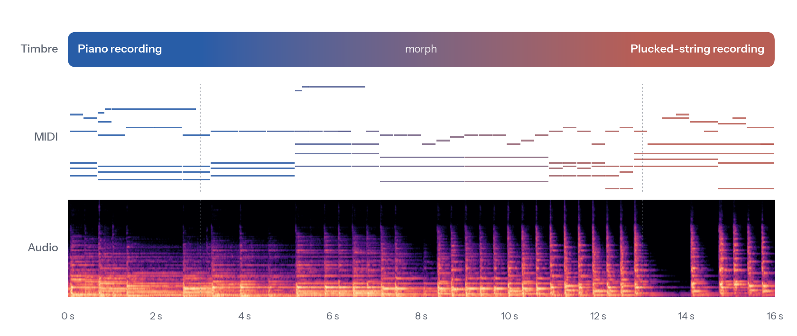

<div align="center">

# LiveSynth

**A streaming neural synthesizer for instrument cloning and text-to-instrument**

Kyungsu Kim, Yejin Kim, Kyogu Lee<br>
Music and Audio Research Group, Seoul National University

[](https://kyungsukim42.github.io/livesynth-demo/)
[](https://huggingface.co/KyungsuKim/LiveSynth)
[](#installation)

</div>

<picture>
  <source media="(prefers-color-scheme: dark)" srcset="docs/assets/hero_dark.png">
  
</picture>

<p align="center"><sub>One streamed performance. The timbre moves from a piano recording to a plucked-string recording
between 3&nbsp;s and 13&nbsp;s while the MIDI keeps playing. <a href="docs/assets/hero.mp4">Listen to this performance</a><br>
MIDI excerpt from the Lakh MIDI Dataset; reference recordings from NSynth.</sub></p>

LiveSynth turns MIDI into 48-kHz audio in the timbre of any instrument, given a
short reference recording or a text prompt. It generates one frame at a time
with no lookahead, so the same model renders files offline and plays live from
a MIDI keyboard, and its timbre can change on every frame.

## Installation

```bash
pip install livesynth
```

> [!NOTE]
> LiveSynth needs Python 3.10, 3.11 or 3.12. On Linux with an NVIDIA GPU, first
> install the [PyTorch build](https://pytorch.org/get-started/locally/) that
> matches your driver; the default build on PyPI needs a recent driver. The model
> weights (about 400 MB) and the CLAP timbre encoder are downloaded from the
> Hugging Face Hub the first time the model is loaded.

## Quick start

```python
import soundfile as sf
from livesynth import LiveSynth

synth = LiveSynth.from_pretrained()

timbre = synth.embed_audio("cello.wav")      # any recording of the instrument
audio = synth.render("song.mid", timbre)
sf.write("song_cello.wav", audio, synth.sample_rate)
```

`python quickstart.py song.mid [reference.wav]` writes one example of each
feature below.

## What you can do

**Clone an instrument from a recording.** LiveSynth listens to the loudest
10 s of the recording. Fifty-three built-in presets are ready to use; each is
the embedding of a 10-s clip of an NSynth instrument held out from training.

```python
audio = synth.render("song.mid", synth.embed_audio("my_synth.wav"))
audio = synth.render("song.mid", "keyboard_acoustic_004")    # a preset
synth.preset_audio("keyboard_acoustic_004")                  # the recording behind it
```

**Describe an instrument in words.**

```python
audio = synth.render("song.mid", synth.embed_text("the sound of an acoustic string"))
```

**Morph between instruments.** The timbre follows a spherical path between two
embeddings and is updated every frame. The figure above was made with this call:

```python
audio = synth.morph("song.mid", "keyboard_acoustic_004", "string_acoustic_056",
                    start=3.0, end=13.0)
```

**Render in batches.**

```python
audios = synth.render_batch(["a.mid", "b.mid"],
                            ["brass_acoustic_059", "organ_electronic_057"])
```

The full Python API, including per-frame timbre paths and the streaming engine,
is described in [docs/api.md](docs/api.md).

## Play it live

```bash
pip install "livesynth[live]"
livesynth-live
```

The window has two timbre slots and a morph slider between them. Each slot
takes a preset, a recording dropped onto it, or a text prompt. Play from any
MIDI controller (or the virtual port *LiveSynth In*) or from the computer
keyboard: `A W S E D F T G Y H U J K` play one octave, `Z`/`X` shift the
octave, `C`/`V` change the velocity and `Space` releases every note. The
engine runs on MLX on Apple Silicon (installed automatically there) and on
PyTorch with a CUDA graph on NVIDIA GPUs.

<!-- TODO: screenshot of the live window (light and dark) -->

## How it works

* **Causal VAE codec.** Audio is represented by 128-dimensional continuous
  latents at 100 frames per second. Only its small causal decoder is needed
  for synthesis.
* **Feedback-free generator.** A 190 M-parameter causal Transformer maps
  per-frame Gaussian noise, MIDI and timbre to latents. It never reads its own
  output, so it runs as one parallel pass offline or frame by frame with a
  bounded key/value cache in real time, and both paths compute the same
  function.
* **Conditioning.** MIDI enters once at the input as a per-pitch state with
  note velocity and note age. The timbre, a LAION-CLAP embedding, modulates
  every block through adaLN-Zero and may differ from frame to frame.

## Roadmap

- [x] Offline inference API (rendering, batching, morphing)
- [x] Automatic weight download from the Hugging Face Hub
- [x] Real-time GUI with MIDI controller and computer-keyboard input
- [ ] VST3 / AU plug-in and standalone app

## License

LiveSynth is released under the [MIT License](LICENSE), both the code and the
model weights.

## Acknowledgements

Reference recordings and presets come from the
[NSynth dataset](https://magenta.tensorflow.org/datasets/nsynth) (CC BY 4.0),
and the MIDI excerpt in the figure from the
[Lakh MIDI Dataset](https://colinraffel.com/projects/lmd/) (CC BY 4.0).
LiveSynth uses [LAION-CLAP](https://github.com/LAION-AI/CLAP) for timbre
embeddings and a [Vocos](https://github.com/gemelo-ai/vocos)-style decoder.
